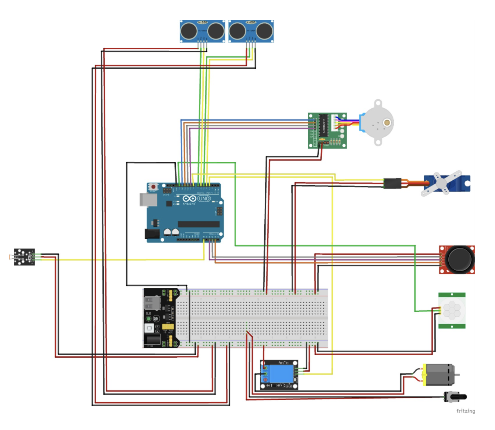

# Smart Ventilator Prototype

## Overview
The **Smart Ventilator Prototype** is a next-generation fan system designed to improve personal comfort and energy efficiency. By integrating motion detection, distance sensors, temperature control, and manual override capabilities, the fan automatically adjusts airflow direction based on user presence and environmental conditions. 

This project demonstrates the use of hardware and software to create a functional prototype aimed at optimizing personal climate control in dynamic environments like shared workspaces or homes.

---

## Features
- **Automatic Mode**: Detects motion and adjusts airflow direction towards the nearest person.
- **Energy Efficiency**: Operates only when motion is detected, the environment is sufficiently lit, and the temperature is above 18°C.
- **Manual Mode**: Allows users to manually control fan direction and speed using a joystick.
- **Adaptive Design**: Uses servo and stepper motors for smooth directional adjustments.

---

## Hardware Requirements
- **Arduino Board** (compatible with the Servo and Stepper libraries)
- **Stepper Motor** (with a stepper driver)
- **Servo Motor**
- **PIR Motion Sensor** (KY-018)
- **Photoresistor** (for light level detection)
- **Ultrasonic Sensors** (for distance detection)
- **Joystick Module**
- **Relay Module**
- **Fan** (with a motor)
- **3D-printed Components** (for the fan structure)
- **Power Supply** (capable of handling motor and sensor power requirements)

---

## Software Dependencies
- **Arduino IDE**: Used to program the microcontroller.
- **Libraries**:
  - Servo.h
  - Stepper.h
  - OneWire.h
  - DallasTemperature.h

---

## Setup Instructions
1. **Hardware Assembly**:
   - Connect the sensors, motors, and joystick to the Arduino as defined in the code.
   - Mount the fan and motors in the 3D-printed structure.
   - Ensure proper cable management to avoid interference with motor movement.

2. **Software Setup**:
   - Install the required libraries in the Arduino IDE.
   - Upload the provided code to the Arduino board.

3. **Calibration**:
   - The system will auto-calibrate on startup. Ensure the environment is clear for proper initial positioning.

---

## Usage Modes
- **Mode 0: Off**  
  The fan is inactive, and motors are reset to their initial positions.
- **Mode 1: Automatic**  
  The fan operates automatically based on motion detection and environmental conditions.
- **Mode 2: Manual**  
  Users can control fan direction and speed using the joystick.
- **Mode 3: Demo**  
  The fan operates without considering optional sensors.

---

## Circuit Diagram
Ensure all connections match the configuration outlined in the code. Key pins include:
- Servo motor: Pin 8
- Stepper motor: Pins 9, 10, 11, 12
- PIR motion sensor: Pin 13
- Photoresistor: Analog Pin A0
- Joystick: Analog Pins A2, A3, A4
- Ultrasonic sensors: Trigger/Echo Pins 5/4 and 7/6
- Relay: Pin 3

